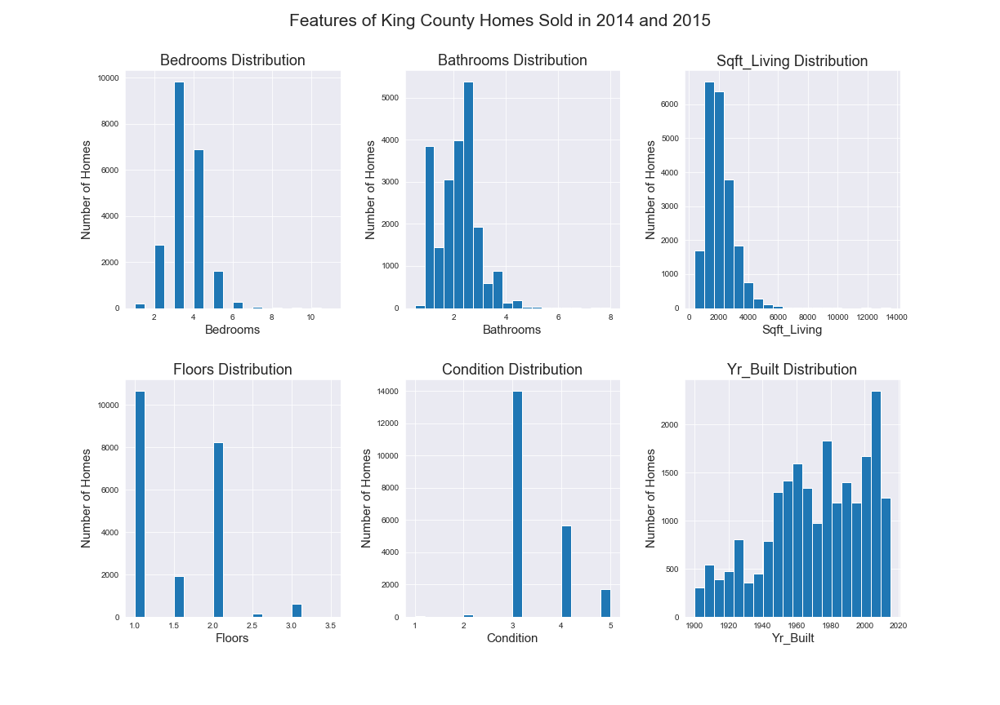

# An Introduction to Subplots in Matplotlib

Author: Lili Beit

This repo contains code referenced in my [blog post](https://medium.com/analytics-vidhya/an-introduction-to-subplots-in-matplotlib-b8b4821b47d1) about creating subplots, published in [Analytics Vidhya](https://medium.com/analytics-vidhya).

This post explains how to create basic subplots and how to automate the creation of multiple subplots, as shown below:

